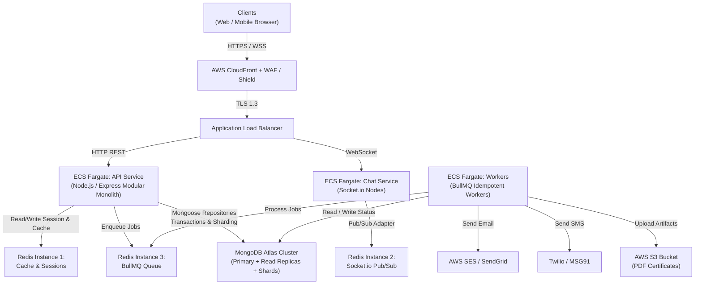

# ARCHITECTURE.md — System Architecture & Technical Specifications

## 1. Flow & Architecture

### 1.1 High-Level System Architecture



---

### 1.2 Core Architectural Principles & Flows

#### 1.2.1 Modular Monolith Architecture
The backend application is organized into:
- `apps/api/src/core/`: Application runtime, config, base classes (`BaseRepository`, `BaseService`, `BaseController`, `BaseModel`), global error handling, logging, caching, and shared security middlewares.
- `apps/api/src/modules/`: Domain feature modules (`auth`, `users`, `admin`, `super-admin`, `events`, `teams`, `shifts`, `applications`, `attendance`, `certificates`, `reviews`, `chat`, `notifications`, `analytics`).
- **Standard Module Shape**: Every module strictly follows:
  `*.routes.js` → `*.controller.js` → `*.service.js` → `*.repository.js` → `*.model.js`
  along with `*.validator.js`, `*.permissions.js`, `*.index.js`, and `__tests__/`.

#### 1.2.2 Authentication & Permission-Based RBAC Flow
- **Token Design**: Short-lived JWT access tokens + rotating refresh tokens.
- **Session Revocation**: Stored in Redis cache. `sessionTerminator.js` acts as the single unified engine for both Admin "Deactivate" and Super Admin "Revoke", immediately blacklisting tokens.
- **RBAC Pipeline**: Requests pass through `auth.middleware.js` (validates signature, expiration, and blacklist status), followed by `rbac.middleware.js`. The middleware resolves the user's role-default permissions from `shared-constants/permissions.js` and applies any per-user `ACCESS_GRANT` overrides stored in the database.

#### 1.2.3 Atomic Event Creation
- Creating an Event requires generating the Event record, initial default Teams, and Team Chat Rooms.
- Handled atomically within a single MongoDB multi-document transaction managed by `BaseRepository.js`. Failure in any sub-step rolls back the entire operation.

#### 1.2.4 Event-Driven Application Approval
- When an applicant is approved by a T2 or T3 lead via `applications.service.js`, the service emits `APPLICATION_APPROVED`.
- An asynchronous event listener (`applicationApproved.listener.js`) catches the event and adds the volunteer to the corresponding team chat room and roster. The HTTP response is not blocked by chat room enrollment.

#### 1.2.5 Real-Time Chat Architecture
- Implemented with Socket.io backed by a dedicated Redis Pub/Sub instance.
- **Room Authentication**: Sockets authenticate with the JWT during connection handshake.
- **Rate Limiting**: Sockets enforce a per-connection rate limit to mitigate flood abuse.
- **Lifecycle**: When an event transitions to `COMPLETED` or `ARCHIVED`, its associated chat rooms are switched to read-only mode.

#### 1.2.6 QR Attendance Verification
- Dynamic QR codes generated for shifts.
- On event day, volunteers present the QR code or scan event station QRs.
- Verification updates the attendance state via `attendance.service.js` with optimistic locking to prevent race conditions.

#### 1.2.7 Write-Path Cache Invalidation
- Writes never rely on passive TTL expiration.
- Mutating services must invoke `cacheInvalidator.js` explicitly on the exact affected cache keys to avoid stale reads.

---

## 2. Tech Stack

| Layer | Technology | Rationale |
|---|---|---|
| **Frontend Web** | React 18 (Vite), Tailwind CSS | Fast bundling, responsive mobile-first UI, lightweight client bundle |
| **Icons & UI** | Lucide React, Custom Base UI | Lightweight, accessible, consistent design tokens |
| **Backend API** | Node.js (v24 LTS), Express.js | Mature ecosystem, non-blocking I/O, modular architecture |
| **Database** | MongoDB Atlas (Mongoose ODM) | Flexible document model for events/shifts, atomic transactions, sharding support |
| **Caching & Pub/Sub** | Redis (ElastiCache) — 3 isolated instances | Dedicated instances for: 1. Sessions/Cache, 2. Chat Pub/Sub, 3. BullMQ queue |
| **Real-Time Chat** | Socket.io + `@socket.io/redis-adapter` | Reliable WebSocket fallback, room management, horizontal scaling |
| **Job Queue** | BullMQ | Distributed, robust background processing with Redis |
| **Certificate Gen** | PDFKit / Canvas QR generator | Fast server-side vector PDF generation with embedded QR codes |
| **Infra & Cloud** | AWS ECS Fargate, CloudFront, ALB, WAF | Serverless containers, global edge caching, DDoS perimeter defense |
| **IaC** | Terraform | Reproducible multi-environment provisioning (VPC, ECS, Redis, Atlas) |

---

## 3. Folder & File Structure

```text
tbi/
├── .github/
│   └── workflows/
│       ├── ci.yml                           # Lint, test, and type-check
│       └── deploy.yml                       # ECS deployment pipeline
├── apps/
│   ├── api/
│   │   ├── Dockerfile
│   │   ├── package.json
│   │   └── src/
│   │       ├── core/
│   │       │   ├── config/
│   │       │   │   ├── env.config.js
│   │       │   │   ├── rbac.config.js
│   │       │   │   ├── redis-cache.client.js
│   │       │   │   ├── redis-pubsub.client.js
│   │       │   │   └── redis-queue.client.js
│   │       │   ├── database/
│   │       │   │   ├── connection.js
│   │       │   │   ├── BaseRepository.js   # [Red-Zone] Atomic transaction support
│   │       │   │   └── BaseModel.js
│   │       │   ├── middleware/
│   │       │   │   ├── auth.middleware.js  # [Red-Zone] JWT verification & blacklist check
│   │       │   │   ├── rbac.middleware.js  # [Red-Zone] Granular permission resolution
│   │       │   │   ├── mfa.middleware.js   # [Red-Zone] Admin/Super Admin TOTP enforcement
│   │       │   │   ├── rateLimiter.middleware.js
│   │       │   │   └── error.middleware.js # ApiError centralized handler
│   │       │   ├── session/
│   │       │   │   └── sessionTerminator.js # [Red-Zone] Unified session termination
│   │       │   ├── cache/
│   │       │   │   ├── cacheService.js
│   │       │   │   └── cacheInvalidator.js # Explicit write-path invalidation
│   │       │   ├── errors/
│   │       │   │   ├── ApiError.js
│   │       │   │   └── typedErrors.js
│   │       │   ├── utils/
│   │       │   │   ├── logger.js           # Winston structured logger
│   │       │   │   ├── asyncHandler.js
│   │       │   │   └── apiResponse.js
│   │       │   └── app.js
│   │       ├── modules/
│   │       │   ├── auth/                    # [Red-Zone] Authentication module
│   │       │   │   ├── auth.routes.js
│   │       │   │   ├── auth.controller.js
│   │       │   │   ├── auth.service.js
│   │       │   │   ├── mfa.service.js
│   │       │   │   ├── auth.validator.js
│   │       │   │   ├── auth.permissions.js
│   │       │   │   ├── auth.index.js
│   │       │   │   └── __tests__/
│   │       │   ├── users/                   # User profiles & management
│   │       │   │   ├── users.routes.js
│   │       │   │   ├── users.controller.js
│   │       │   │   ├── users.service.js
│   │       │   │   ├── users.repository.js
│   │       │   │   ├── users.model.js
│   │       │   │   ├── users.validator.js
│   │       │   │   ├── users.permissions.js
│   │       │   │   ├── users.index.js
│   │       │   │   └── __tests__/
│   │       │   ├── admin/                   # Admin user & CSV provisioning
│   │       │   │   ├── admin.routes.js
│   │       │   │   ├── admin.controller.js
│   │       │   │   ├── admin.service.js    # [Red-Zone] Provisioning & deactivation
│   │       │   │   ├── admin.repository.js
│   │       │   │   ├── admin.validator.js
│   │       │   │   ├── admin.permissions.js
│   │       │   │   ├── admin.index.js
│   │       │   │   └── __tests__/
│   │       │   ├── super-admin/             # Super Admin controls & audits
│   │       │   │   ├── super-admin.routes.js
│   │       │   │   ├── super-admin.controller.js
│   │       │   │   ├── revocation.service.js # [Red-Zone] Revocation engine
│   │       │   │   ├── super-admin.repository.js
│   │       │   │   ├── super-admin.validator.js
│   │       │   │   ├── super-admin.permissions.js
│   │       │   │   ├── super-admin.index.js
│   │       │   │   └── __tests__/
│   │       │   ├── events/                  # Atomic event creation & listing
│   │       │   │   ├── events.routes.js
│   │       │   │   ├── events.controller.js
│   │       │   │   ├── events.service.js
│   │       │   │   ├── events.repository.js
│   │       │   │   ├── events.model.js
│   │       │   │   ├── events.validator.js
│   │       │   │   ├── events.permissions.js
│   │       │   │   ├── events.index.js
│   │       │   │   └── __tests__/
│   │       │   ├── teams/                   # Team structure & leads
│   │       │   │   ├── teams.routes.js
│   │       │   │   ├── teams.controller.js
│   │       │   │   ├── teams.service.js
│   │       │   │   ├── teams.repository.js
│   │       │   │   ├── teams.model.js
│   │       │   │   ├── teams.validator.js
│   │       │   │   ├── teams.permissions.js
│   │       │   │   ├── teams.index.js
│   │       │   │   └── __tests__/
│   │       │   ├── shifts/                  # Shifts & capacity reservation
│   │       │   │   ├── shifts.routes.js
│   │       │   │   ├── shifts.controller.js
│   │       │   │   ├── shifts.service.js
│   │       │   │   ├── shifts.repository.js
│   │       │   │   ├── shifts.model.js
│   │       │   │   ├── shifts.validator.js
│   │       │   │   ├── shifts.permissions.js
│   │       │   │   ├── shifts.index.js
│   │       │   │   └── __tests__/
│   │       │   ├── applications/            # Volunteer applications
│   │       │   │   ├── applications.routes.js
│   │       │   │   ├── applications.controller.js
│   │       │   │   ├── applications.service.js
│   │       │   │   ├── applicationApproved.listener.js # Event-driven chat add
│   │       │   │   ├── applications.repository.js
│   │       │   │   ├── applications.model.js
│   │       │   │   ├── applications.validator.js
│   │       │   │   ├── applications.permissions.js
│   │       │   │   ├── applications.index.js
│   │       │   │   └── __tests__/
│   │       │   ├── attendance/              # QR-based check-in
│   │       │   │   ├── attendance.routes.js
│   │       │   │   ├── attendance.controller.js
│   │       │   │   ├── attendance.service.js
│   │       │   │   ├── qr.service.js
│   │       │   │   ├── attendance.repository.js
│   │       │   │   ├── attendance.model.js
│   │       │   │   ├── attendance.validator.js
│   │       │   │   ├── attendance.permissions.js
│   │       │   │   ├── attendance.index.js
│   │       │   │   └── __tests__/
│   │       │   ├── certificates/            # PDF generation & verification
│   │       │   │   ├── certificates.routes.js
│   │       │   │   ├── certificates.controller.js
│   │       │   │   ├── certificates.service.js
│   │       │   │   ├── pdfGenerator.js
│   │       │   │   ├── certificates.repository.js
│   │       │   │   ├── certificates.model.js
│   │       │   │   ├── certificates.validator.js
│   │       │   │   ├── certificates.permissions.js
│   │       │   │   ├── certificates.index.js
│   │       │   │   └── __tests__/
│   │       │   ├── reviews/                 # Post-event ratings
│   │       │   │   ├── reviews.routes.js
│   │       │   │   ├── reviews.controller.js
│   │       │   │   ├── reviews.service.js
│   │       │   │   ├── reviews.repository.js
│   │       │   │   ├── reviews.model.js
│   │       │   │   ├── reviews.validator.js
│   │       │   │   ├── reviews.permissions.js
│   │       │   │   ├── reviews.index.js
│   │       │   │   └── __tests__/
│   │       │   ├── chat/                    # Real-time chat & socket handlers
│   │       │   │   ├── chat.socket.js
│   │       │   │   ├── chat.service.js
│   │       │   │   ├── chat.rateLimiter.js
│   │       │   │   ├── chat.repository.js
│   │       │   │   ├── chat.model.js
│   │       │   │   ├── chat.permissions.js
│   │       │   │   ├── chat.index.js
│   │       │   │   └── __tests__/
│   │       │   ├── notifications/           # In-app push & dispatchers
│   │       │   │   ├── notifications.routes.js
│   │       │   │   ├── notifications.service.js
│   │       │   │   ├── notifications.repository.js
│   │       │   │   ├── notifications.model.js
│   │       │   │   └── __tests__/
│   │       │   └── analytics/               # Dashboards & metrics
│   │       │       ├── analytics.routes.js
│   │       │       ├── analytics.controller.js
│   │       │       ├── analytics.service.js
│   │       │       └── __tests__/
│   │       └── server.js
│   ├── web/
│   │   ├── Dockerfile
│   │   ├── index.html
│   │   ├── package.json
│   │   ├── vite.config.js
│   │   └── src/
│   │       ├── assets/
│   │       ├── core/
│   │       │   ├── api/apiClient.js
│   │       │   ├── auth/AuthContext.jsx
│   │       │   ├── router/
│   │       │   │   ├── AppRoutes.jsx
│   │       │   │   └── RoleRoute.jsx
│   │       │   └── layouts/
│   │       │       ├── SuperAdminLayout.jsx
│   │       │       ├── AdminLayout.jsx
│   │       │       ├── T3Layout.jsx
│   │       │       ├── T2Layout.jsx
│   │       │       └── T1Layout.jsx
│   │       ├── components/
│   │       │   ├── Button.jsx
│   │       │   ├── Input.jsx
│   │       │   ├── Modal.jsx
│   │       │   ├── Table.jsx
│   │       │   ├── Loader.jsx
│   │       │   ├── Card.jsx
│   │       │   ├── Pagination.jsx
│   │       │   ├── Toast.jsx
│   │       │   ├── EmptyState.jsx
│   │       │   └── ErrorBoundary.jsx
│   │       ├── locales/
│   │       │   ├── en.json
│   │       │   └── hi.json
│   │       ├── modules/
│   │       │   ├── auth/
│   │       │   ├── events/
│   │       │   ├── applications/
│   │       │   ├── attendance/
│   │       │   ├── chat/
│   │       │   ├── certificates/
│   │       │   ├── admin/
│   │       │   └── super-admin/
│   │       ├── App.jsx
│   │       └── main.jsx
│   └── workers/
│       ├── Dockerfile
│       ├── package.json
│       └── src/
│           ├── index.js
│           ├── jobs/
│           │   ├── scheduler.js
│           │   └── definitions/
│           │       ├── sendEmail.job.js
│           │       ├── sendSMS.job.js
│           │       ├── generateCertificate.job.js
│           │       └── preScaleForEvent.job.js
│           └── workers/
│               ├── notification.worker.js
│               └── certificate.worker.js
├── packages/
│   ├── shared-constants/
│   │   ├── package.json
│   │   ├── index.js
│   │   ├── roles.js
│   │   ├── permissions.js
│   │   └── tiers.js
│   ├── shared-types/
│   │   ├── package.json
│   │   └── index.js
│   └── shared-utils/
│       ├── package.json
│       ├── index.js
│       └── idempotency.util.js
├── infrastructure/
│   └── terraform/
│       ├── main.tf
│       ├── variables.tf
│       └── modules/
│           ├── vpc/
│           ├── ecs/
│           ├── elasticache/
│           ├── mongodb-atlas/
│           └── autoscaling/
│               └── scheduled-scaling.tf
├── docker-compose.yml
├── .env.example
├── pnpm-workspace.yaml
├── package.json
└── turbo.json
```
