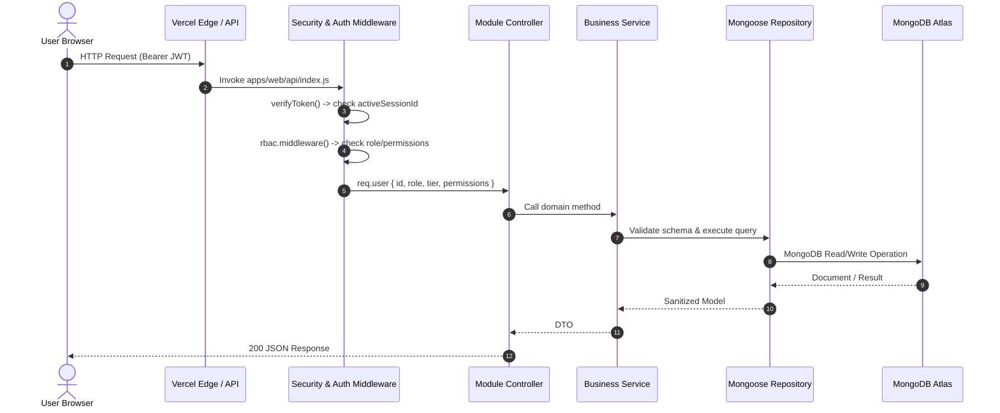

# ARCHITECTURE.md — System Architecture & Technical Specifications

**Last updated:** 2026-10-05  
**Production commit:** `8a85481`  
**Verified against code:** yes  

---

## 1. High-Level Architecture

TBI-GEU is a monorepo consisting of a React frontend and Node.js/Express API deployed to Vercel (production serverless) and Docker/local Node (development).

```mermaid
flowchart TD
    Client["Browser (Desktop / Mobile)"] -->|HTTPS / WSS| Vercel["Vercel Edge & CDN"]
    Vercel -->|Static Assets| WebDist["Vite SPA (apps/web/dist)"]
    Vercel -->|/api/*| Serverless["Vercel Node Serverless Function"]
    
    subgraph Vercel Function
        Handler["apps/web/api/index.js"] --> App["apps/web/server/server.js (Express)"]
        DevAPI["apps/api/src/server.js (Dev / Docker / Tests)"]
    end
    
    App -->|Mongoose ODM| Mongo[("MongoDB Atlas")]
    App -->|In-Memory Map| LocalCache["In-Memory Cache & Limiter"]
    
    subgraph Target Infra (Phase 7)
        Redis[("Redis Cluster")]
        BullMQ["BullMQ Workers (apps/workers/)"]
    end
```

---

## 2. Monorepo Structure & File Paths

| Path | Purpose | Runtime / Build |
|------|---------|-----------------|
| [apps/web/](file:///e:/project%20emp/tbi/apps/web) | Frontend SPA + Vercel serverless API wrapper | Vite 5, React 18, TailwindCSS 3 |
| [apps/web/src/](file:///e:/project%20emp/tbi/apps/web/src) | Client UI components, routes, API clients | Browser JS / JSX |
| [apps/web/server/](file:///e:/project%20emp/tbi/apps/web/server) | Serverless production Express API backend | Node.js CommonJS |
| [apps/web/api/index.js](file:///e:/project%20emp/tbi/apps/web/api/index.js) | Vercel Serverless Function entry point | Node.js ES module wrapper |
| [apps/api/](file:///e:/project%20emp/tbi/apps/api) | Full-featured standalone Express API + test runner | Node.js CommonJS (port 5000) |
| [apps/workers/](file:///e:/project%20emp/tbi/apps/workers) | BullMQ worker stubs (certificates, notifications) | Node.js (inactive in Vercel) |
| [packages/shared-constants/](file:///e:/project%20emp/tbi/packages/shared-constants) | Roles, permissions, tier constants | Shared npm package |
| [packages/shared-types/](file:///e:/project%20emp/tbi/packages/shared-types) | JSDoc typedefs & schema contracts | Shared npm package |
| [packages/shared-utils/](file:///e:/project%20emp/tbi/packages/shared-utils) | Idempotency & helper utilities | Shared npm package |
| [infrastructure/terraform/](file:///e:/project%20emp/tbi/infrastructure/terraform) | Terraform config for AWS/Atlas target infra | HCL (Phase 7 scale plan) |

---

## 3. Backend Module Map

Every domain module follows the standard shape:
`*.routes.js` → `*.controller.js` → `*.service.js` → `*.repository.js` → `*.model.js` + `*.permissions.js` + `*.validator.js` + `__tests__/`

| Module | Location | Primary Purpose | Key Routes |
|--------|----------|-----------------|------------|
| **Auth** | [apps/web/server/modules/auth/](file:///e:/project%20emp/tbi/apps/web/server/modules/auth/) | Login, JWT lifecycle, TOTP MFA, single session | `POST /api/v1/auth/login`, `POST /refresh`, `POST /mfa/verify` |
| **Users** | [apps/web/server/modules/users/](file:///e:/project%20emp/tbi/apps/web/server/modules/users/) | User listings, account profiles, preferences | `GET /api/v1/users`, `GET /api/v1/users/me` |
| **Profile** | [apps/web/server/modules/profile/](file:///e:/project%20emp/tbi/apps/web/server/modules/profile/) | Naukri-style profile, completion %, avatars | `GET /api/v1/profile/me`, `PATCH /me`, `POST /avatar`, `GET /user/:userId` |
| **Admin** | [apps/web/server/modules/admin/](file:///e:/project%20emp/tbi/apps/web/server/modules/admin/) | Provisioning, bulk CSV import, deactivation | `POST /api/v1/admin/users`, `POST /bulk-import`, `PATCH /users/:id/tier` |
| **Super Admin**| [apps/web/server/modules/super-admin/](file:///e:/project%20emp/tbi/apps/web/server/modules/super-admin/) | Security audits, token revocation, RBAC grant | `POST /api/v1/super-admin/revoke-user` |
| **Events** | [apps/web/server/modules/events/](file:///e:/project%20emp/tbi/apps/web/server/modules/events/) | Event CRUD, phases, station QRs | `GET /api/v1/events`, `POST /api/v1/events` |
| **Teams** | [apps/web/server/modules/teams/](file:///e:/project%20emp/tbi/apps/web/server/modules/teams/) | Teams, lead assignment, user team lists | `GET /api/v1/teams`, `GET /my-teams`, `POST /members` |
| **Shifts** | [apps/web/server/modules/shifts/](file:///e:/project%20emp/tbi/apps/web/server/modules/shifts/) | Shift capacity, timings, assignments | `GET /api/v1/shifts`, `POST /api/v1/shifts` |
| **Applications**| [apps/web/server/modules/applications/](file:///e:/project%20emp/tbi/apps/web/server/modules/applications/) | Volunteer application & approval flow | `POST /api/v1/applications`, `PATCH /:id/status` |
| **Attendance** | [apps/web/server/modules/attendance/](file:///e:/project%20emp/tbi/apps/web/server/modules/attendance/) | QR check-in, manual marking, shift roster | `POST /api/v1/attendance/check-in`, `GET /history` |
| **Timesheets** | [apps/web/server/modules/timesheets/](file:///e:/project%20emp/tbi/apps/web/server/modules/timesheets/) | Volunteer hours logging and verification | `GET /api/v1/timesheets`, `POST /api/v1/timesheets` |
| **Certificates**| [apps/web/server/modules/certificates/](file:///e:/project%20emp/tbi/apps/web/server/modules/certificates/) | Certificate metadata & verification (PDF stub) | `GET /api/v1/certificates`, `GET /verify/:hash` |
| **Reviews** | [apps/web/server/modules/reviews/](file:///e:/project%20emp/tbi/apps/web/server/modules/reviews/) | Volunteer performance ratings & feedback | `POST /api/v1/reviews`, `GET /events/:id` |
| **Chat** | [apps/web/server/modules/chat/](file:///e:/project%20emp/tbi/apps/web/server/modules/chat/) | Room chat, message history (polling + socket) | `GET /api/v1/chat/rooms`, `POST /messages` |
| **Notifications**| [apps/web/server/modules/notifications/](file:///e:/project%20emp/tbi/apps/web/server/modules/notifications/) | In-app notification delivery & dispatch | `GET /api/v1/notifications`, `PATCH /read` |
| **Stats** | [apps/web/server/modules/stats/](file:///e:/project%20emp/tbi/apps/web/server/modules/stats/) | Aggregate KPI stats for Admin dashboards | `GET /api/v1/stats/overview` |

---

## 4. Data Flow & Security Pipeline

```mermaid
sequenceDiagram
    autonumber
    actor User as User Browser
    participant Vercel as Vercel Edge / API
    participant MW as Security & Auth Middleware
    participant Controller as Module Controller
    participant Service as Business Service
    participant Repo as Mongoose Repository
    participant DB as MongoDB Atlas

    User->>Vercel: HTTP Request (Bearer JWT)
    Vercel->>MW: Invoke apps/web/api/index.js
    MW->>MW: verifyToken() -> check activeSessionId
    MW->>MW: rbac.middleware() -> check role/permissions
    MW->>Controller: req.user { id, role, tier, permissions }
    Controller->>Service: Call domain method
    Service->>Repo: Validate schema & execute query
    Repo->>DB: MongoDB Read/Write Operation
    DB-->>Repo: Document / Result
    Repo-->>Service: Sanitized Model
    Service-->>Controller: DTO
    Controller-->>User: 200 JSON Response
```

### Core Security Middlewares:
- [auth.middleware.js](file:///e:/project%20emp/tbi/apps/web/server/middleware/auth.middleware.js): Validates JWT signature, expiration, token purpose, and active session ID.
- [rbac.middleware.js](file:///e:/project%20emp/tbi/apps/web/server/middleware/rbac.middleware.js): Compares required permission against resolved permissions.
- [verifyCaptcha.js](file:///e:/project%20emp/tbi/apps/web/server/middleware/verifyCaptcha.js): Validates Google reCAPTCHA v2 token on login requests.
- [security.middleware.js](file:///e:/project%20emp/tbi/apps/web/server/middleware/security.middleware.js): Security headers, body limiters, rate limiting.

---

## 5. Vercel Production Setup

### Configuration Files:
- [vercel.json (Root)](file:///e:/project%20emp/tbi/vercel.json):
  - Builds: `@vercel/node` for `apps/api/src/server.js`, `@vercel/static-build` for `apps/web/package.json` (`distDir: "dist"`).
  - Routes: `/api/(.*)` to API handler, `/(.*)` to static dist with SPA fallback.
- [apps/web/vercel.json](file:///e:/project%20emp/tbi/apps/web/vercel.json): Rewrites `/api/(.*)` to `/api` and non-API paths to `/index.html`.
- [apps/web/api/index.js](file:///e:/project%20emp/tbi/apps/web/api/index.js): Serverless function entrypoint connecting to MongoDB on warm/cold start and delegating to `apps/web/server/server.js`.

### Environment Variable Names (Secrets NEVER committed):

| Variable Name | Required | Purpose |
|---------------|----------|---------|
| `MONGODB_URI` | 🔴 Required | MongoDB Atlas connection string |
| `JWT_ACCESS_SECRET` | 🔴 Required | HMAC key for signing access tokens |
| `JWT_REFRESH_SECRET` | 🔴 Required | HMAC key for signing refresh tokens |
| `NODE_ENV` | 🔴 Required | Must be `production` |
| `JWT_ACCESS_EXPIRY` | 🟡 Important | e.g. `15m` |
| `JWT_REFRESH_EXPIRY` | 🟡 Important | e.g. `7d` |
| `RECAPTCHA_SECRET_KEY` | 🟡 Important | Google reCAPTCHA v2 verification key |
| `CAPTCHA_ENABLED` | 🟡 Important | `true` or `false` |
| `SESSION_TIMEOUT_MINUTES` | 🟡 Important | Inactivity session timeout |
| `ALLOWED_ORIGINS` | 🟢 Optional | CORS whitelist URL(s) |
| `EMAIL_HOST`, `EMAIL_PORT`, `EMAIL_USER`, `EMAIL_PASS`, `EMAIL_FROM` | 🟢 Optional | SMTP credentials |
| `MFA_ENCRYPTION_KEY` | 🟢 Optional | 32-byte hex key for TOTP secrets |

---

## 6. Integrations & External Services

- **MongoDB Atlas**: Primary persistent database.
- **Google reCAPTCHA v2**: Bot prevention on authentication routes.
- **Google Fonts CDN**: Typography (`Barlow Condensed`, `Rajdhani`, `Space Mono`, `Inter`).
- **Socket.io**: Real-time room chat (functional in local/persistent mode; polling fallback in serverless).
