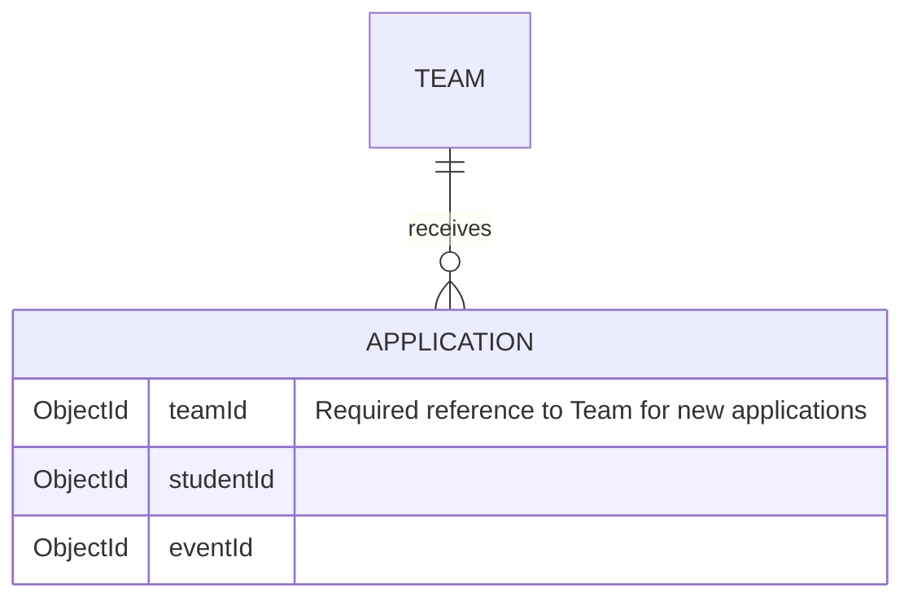

# Application team ownership

The application creation service resolves the submitted team and persists its ID.
Listing filters accept scalar ObjectId strings and known status values. T3 listing
queries always intersect these filters with the IDs of teams led by the requester.
A filter for another team therefore returns no applications. Records with missing
or null `teamId` cannot match this authorization condition, including for leads
with no teams. Admin listings and student self-listings retain access to legacy
records.

## Legacy records

The previous schema discarded `teamId`. There is no safe automatic backfill:
`eventId` does not establish ownership because an event can contain multiple teams.
Do not infer ownership from event membership, names, or the requesting lead.
A trusted operator must recover the original application-to-team mapping from
reliable evidence (such as a backup), verify each referenced team, and persist
those IDs before affected records can appear in T3 listings. If that evidence is
unavailable, leave the records unassigned. The new required field also prevents
saving a legacy application through the status-update flow until ownership is
restored. This change does not mutate existing database records.
