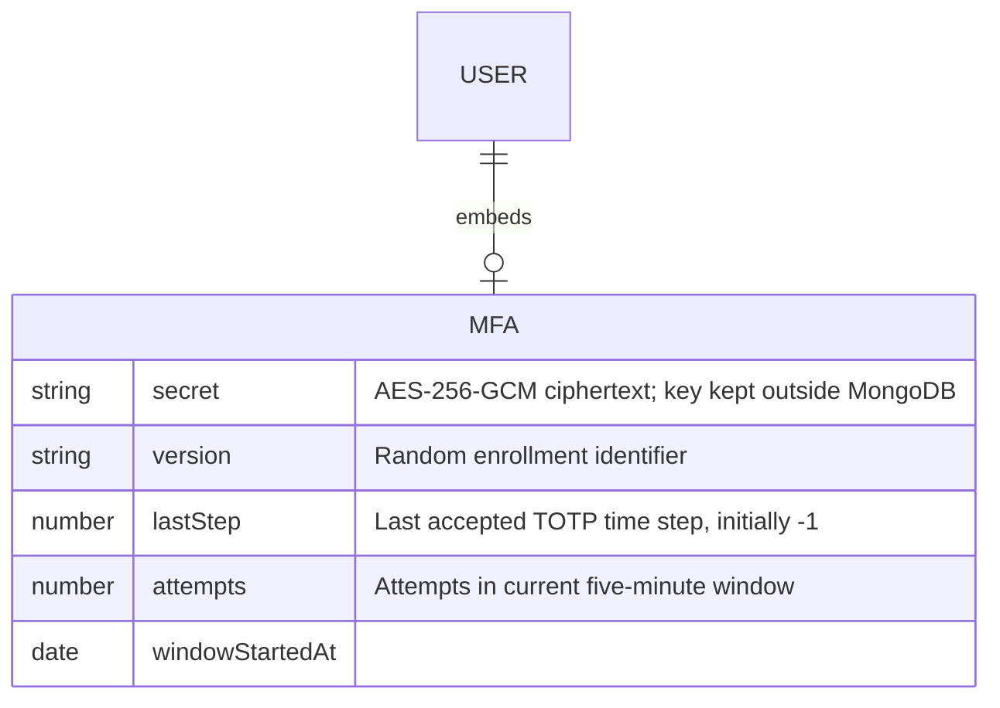

# Privileged user MFA storage

`User.mfa` is optional for existing users and excluded from queries by default.
Privileged accounts without this subdocument cannot log in. Only authentication
repository queries explicitly select it. Enrollment is performed by a trusted
operator; profile and account creation endpoints cannot write MFA fields.
