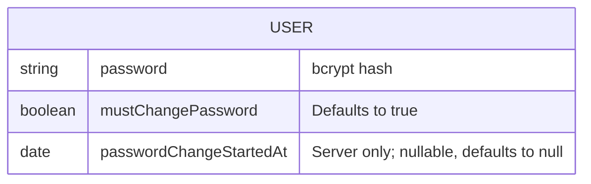

# Mandatory password replacement

`passwordChangeStartedAt` is excluded from queries by default. Existing documents
with no field are treated as unused temporary credentials. Authentication selects
it explicitly. Profile updates cannot set it. No migration is required.

After checking a temporary password (and checking that privileged users have MFA
enrolled), login atomically sets this timestamp only if it is still null and the
password, role, MFA enrollment, and active state still match. Only one concurrent
login succeeds. A consumed temporary password cannot start another login, even
after expiry. Administrative reset/reactivation clears the timestamp when issuing
a new password.

Until replacement, no access or refresh token is issued. Ordinary protected HTTP
routes and Socket.io handshakes reject mandatory-replacement accounts, including
previously issued access tokens. Privileged users must complete the existing MFA
challenge before receiving a password-change token. Both steps share a five-minute
deadline measured from the first temporary-password login.

`POST /auth/login` (or `/auth/mfa/verify` for privileged users) returns
`{ mustChangePassword: true, passwordChangeToken }`. This token is accepted only
as the Bearer credential on `POST /auth/change-password`, with `{ newPassword }`.
The new password must satisfy existing complexity rules and differ from the old
password. Replacement uses a conditional update bound to current credentials;
only one concurrent replacement can succeed. Successful replacement clears the
flag and timestamp, invalidates pending tokens, and requires a fresh login
(including MFA where applicable). Normal access-token password changes still
require `oldPassword`.

The UI keeps replacement tokens in memory. Closing/reloading the page, cancelling,
losing the login response, or exceeding five minutes requires an administrator
to issue a fresh temporary password. Privileged recovery continues to require the
trusted operator procedure described in `../security/mfa-policy.md`.

Deploy API and UI together. This change binds token authentication state to the
replacement flag and timestamp, so existing sessions must sign in again.
